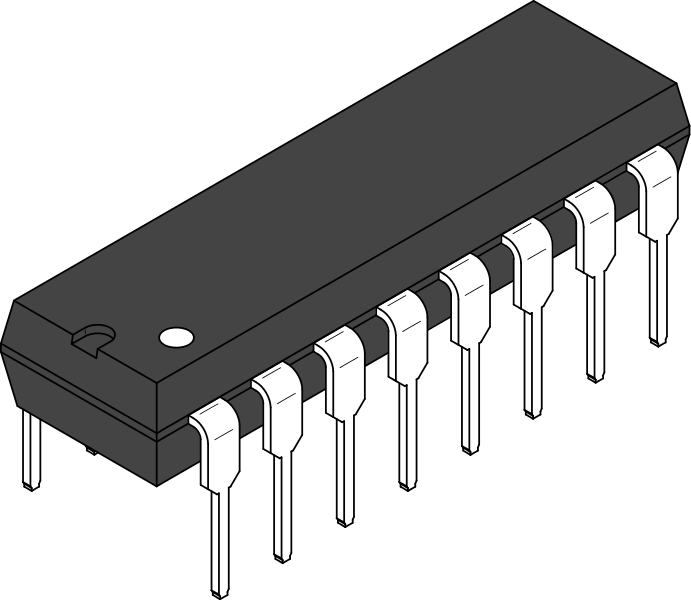
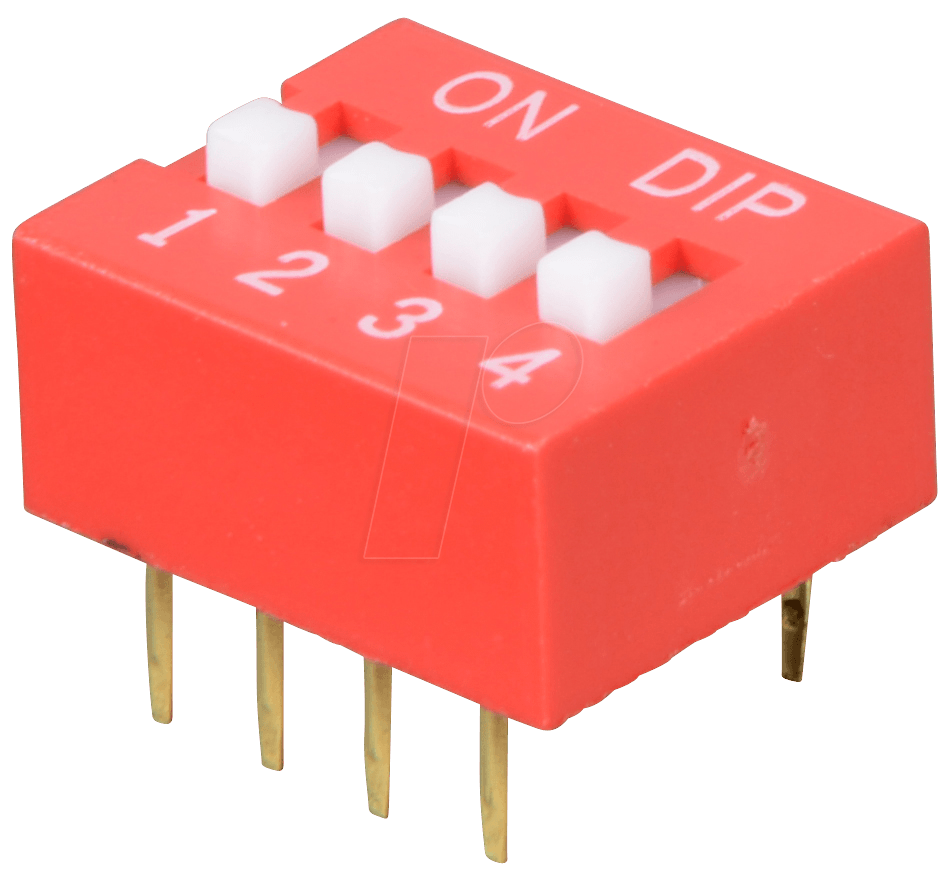
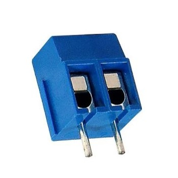
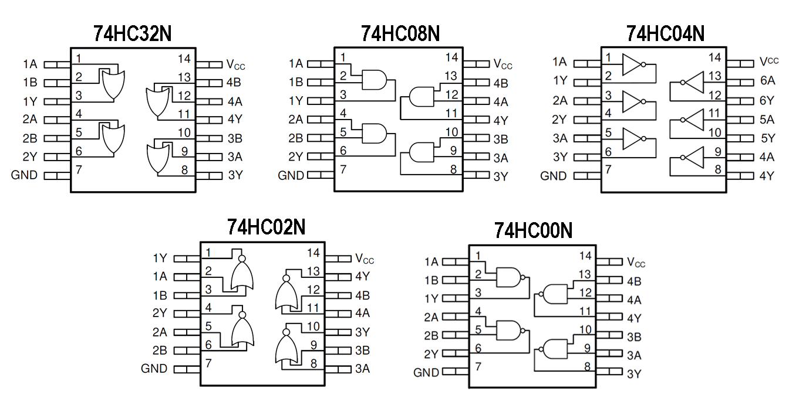
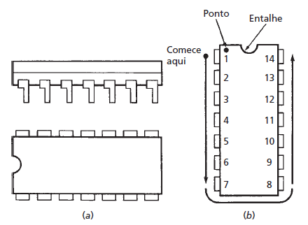

**<h4 align="center"> Universidade Federal do Pará </h4>**

**<h4 align="center">Laboratório de Eletrônica Digital</h4>**

**<h4 align="center">Atividade Prática</h4>**
***

**Objetivos da atividade:**

- Trabalhar o reconhecimento de circuitos digitais;
- Desenvolver habilidade de documentação, minimização e otimização de circuitos digitais;
- Promover contato e manuseio de circuitos lógicos físicos.

**Preparação:**

- O(a) aluno(a) precisará de um computador e um cabo USB-USB tipo A.

### **PARTE 1 - INTRODUÇÃO**

**<h4 align='center'>Considerações gerais</h4>**

- Nesta atividade, analisaremos placas de circuito impresso contendo circuitos lógicos vistos comumente em aulas de Eletrônica Digital.
**Cada placa é composta por:**
- 3 (três) CIs (circuito integrado), de modelos diferentes, cada um contendo um tipo específico de porta lógica dentre as seguintes: 
    - AND
    - OR
    - NOT
    - NAND
    - NOR
    - 1 (um) Dip Switch de 4 vias;
    - 1 (um) LED;
    - 1 (um) Terminal Borne de 2 vias;
    - 1 (um) entrada USB Tipo A fêmea.
    
- Cada placa consiste em um circuito lógico diferente.
- Cada circuito tem 4 entradas e 1 saída.

**<h4 align='center'>Componentes e suas funções</h4>**

- **Circuitos Integrados:** contêm as portas lógicas do circuito.

     
    
    

 

- **Dip Switch:** contêm 4 chaves: 1,2,3 e 4. Cada chave possui duas posições: "ligado" e "desligado". Quando "ligado", a conexão elétrica é estabelecida entre os pinos. As chaves 1,2, 3 e 4 representaram as entradas do circuito lógico.

     
    

 

- **LED:** representa a saída do circuito. Quando ligado, indica saída de nível lógico alto "1". Do contrário, indica saída de nível lógico baixo "0".

     
    

 

- **Entrada USB:** a alimentação principal do sistema é dada por uma entrada USB, conectada ao Dip Switch e aos CIs. A entrada USB tipo A e deve ser conectada a um computador, ou a outra entrada USB tipo A de algum aparelho que forneça a tensão necessária para o funcionamento **correto** do circuito.

    **Observação:** o nosso sistema é alimentado por 5V - padrão do USB e dos CIs -.

     
    

- **Terminal Borne:** a alimentação secudária é dada por um terminal de 2 vias. Só deve ser usada caso a alimentação pela entrada USB não estiver disponível.

     
    

**Observação:** somente a alimentação de USB é necessária para a atividade, o terminal borne deve ser usado apenas com autorização do professor e não é permitido ligar o USB e o terminal ao mesmo tempo.

**Observação:** a posição dos polos positivo e negativo do terminal deve ser considerada.

***

### PARTE 2 - TABELA VERDADE DO CIRCUITO LÓGICO

1. Inicie reconhecendo a disposição dos componentes do circuito;

2. Ligue o circuito
    - Conecte a placa ao computador por meio do cabo USB, para alimentar o circuito.

3. Analise o sinal de saída;
    - Modifique a combinação das chaves 1,2,3 e 4, do Dip Switch e observe o estado o LED.
**Dica:** gire as chaves para o sentido "ON" para fechá-las.
**Dica:** o LED aceso indica o nível lógico alto, 1. o LED desligado indica o nível lógico baixo, 0.

4. Construa a tabela verdade do circuito realizando todas as combinações das entradas do Dip Switch.

**Observação:** esta tabela deve corresponder exatamente ao circuito da placa. Caso contrário, poderá resultar em algum erro durante.

***

### PARTE 3 - **EXPRESSÃO LÓGICA A PARTIR DA TABELA**

1. Abra o Logisim para gerarmos o circuito a partir da tabela;
    - Com o Logisim aberto, vá em Projeto > Analisar Circuito, uma janela deverá aparecer, chamada "Análise Combinacional", onde injetamos nossa tabela verdade;
    - Na aba "Entradas", acrescente as entradas, em ordem, do bit mais significativo para o menos significativo;
    - Na aba "Saídas", acrescente apenas a saída do circuito;
    - Agora, na aba "Tabela", mude o valor da saída em 0 e 1 de acordo com a tabela que você registrou do circuito;
    - Clique no botão abaixo "Construir Circuito", e avance.

    **Observação:** o Logisim gerará um circuito correspondente à tabela verdade, mas não necessariamente este será o será o circuito final.

2. Vá novamente em Projeto > Analisar Circuito
    - Na aba "Expressão", temos a expressão lógica do circuito gerado;
    - Registre a expressão lógica obtida.
    **Observação:** note que, agora temos uma base para rechonecermos o circuito contido na placa, mas não necessariamente este será o circuito final.

***

### **PARTE 4 - CONSTRUÇÃO DO CIRCUITO DA PLACA E OBTENÇÃO DA EXPRESSÃO LÓGICA**

1. Desligue a placa;

2. A respeito das nossas placas, note os seguintes pontos:
    - Os CIs possuem encapsulamento **DIP (Dual Inline Package)**. DIP são chamados "dual" porque possuem duas fileiras de pinos e "inline" porque os pinos estão alinhados em uma única linha reta. O número de pinos em um pacote DIP pode variar, mas nossos CIs são **14 pinos**.

3. Reconheça a pinagem dos componentes da placa;
    - Procure a documentação dos CIs para descobrir suas especificações.
    
    **Dica:** o modelo do CI é escrito na parte de cima dele.

    **Dica:** recorra ao **datasheet** do circuito integrado para obter essas informações. Dentro do repositório, você encontrará uma pasta com os datasheets dos CIs da atividade.

**Dica:** os Cis têm, em uma das bordas laterais, uma cavidade, que server para orientação. Se tratando da família 74XXXX, a numeração começa com a cavidade para o lado esquerdo, e o pino do canto inferior esquerdo é o pino 1, a contagem é feita no sentido anti-horário, como segue a imagem:

<h5 align='center'>Estrutura de conexão de CI: (a) pinos de CI típicos; (b) configuração de numeração de pinos.</h5>

4. Analise as trilhas;

    **Dica:** cada sinal de entrada sai, separadamente, de cada pino do Dip Switch. Os sinais percorrem os CIs e combinam-se em operações lógicas de AND, OR, NOT, NAND e NOR.

    **Dica:** durante o porcesso, você estará obtendo, também, a expressão lógica do circuito. Regisre tanto o circuito quanto a expressão lógica obtida pela análise da placa.

5. Construa o circuito no Logisim;

6. Compare a tabela verdade do circuito do Logisim com o tabela verdade obtida na PARTE 3 do roteiro;

7. Caso sejam iguais, o circuito está correto. Do contrário, repita o processo e/ou analise os possíveis erros.

***

### **PARTE 5 - SIMPLIFICAÇÃO DA EXPRESSÃO LÓGICA**

1. Utilizando álgebra booleana, simplifique a expressão obtida pela análise da placa;

2. Construa um novo circuito no Logisim utilizando a expressão simplificada;

3. Compare a tabela verdade do circuito simplificado com as tabelas verdade obtidas anteriormente. É necessário que todas sejam idênticas para considerar êxito.

**Caso as tabelas sejam iguais, temos que todos os circuitos construídos são equivalentes**

***